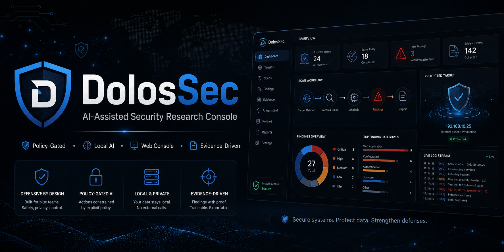

<p align="center">
  
</p>
# DolosSec Agent


**DolosSec** is a clean-room, policy-gated autonomous application-security research framework with a local web control plane. The core trust rule is:

> **The agent proposes → policy authorizes → tools execute → evidence becomes findings.**

The project intentionally avoids giving an LLM an unrestricted network shell. Remote actions are validated against explicit authorization scope, while local source analysis is constrained to approved paths.

## v0.4 — Local AI with Ollama

v0.4 adds a real local/free AI backend using Ollama. DolosSec talks directly to the Ollama REST API and uses JSON-schema structured outputs for planner turns.

Recommended local model:

```bash
ollama pull qwen3.5:9b
```

Then:

```bash
cp .env.example .env
python3 -m venv .venv
source .venv/bin/activate
pip install -e '.[ai,dev]'

dolos ollama status
dolos ollama test
dolos web
```

Open `http://127.0.0.1:8787`.

For complete Linux/Kali, macOS and Windows setup instructions, model profiles, troubleshooting and architecture details, see **[`docs/OLLAMA.md`](docs/OLLAMA.md)**.

### Ollama behavior

- Default local endpoint: `http://127.0.0.1:11434`.
- Remote Ollama hosts are rejected unless `DOLOS_OLLAMA_ALLOW_REMOTE=true` is explicitly configured.
- No API key is required for the normal local Ollama integration.
- The web console detects whether Ollama is online and lists locally installed models.
- A scan can choose project default, local Ollama, deterministic/no-AI, or separately configured OpenAI.
- Before an Ollama-backed run starts, DolosSec verifies that the service is reachable and the selected model is actually installed.
- Model output is validated into `PlannerTurn` before any proposed action reaches the tool broker.
- HTTP responses, source code, comments and tool observations are treated as untrusted model input and are size-bounded before being placed in context.

### Recommended local models

| Profile | Model | Approx. model download |
|---|---|---:|
| Lightweight | `qwen3.5:4b` | 3.4 GB |
| Balanced | `qwen3.5:9b` | 6.6 GB |
| Strong | `qwen3.5:27b` | 17 GB |

## Security Research Console

The local browser interface provides:

- Local-directory target selection with a restricted server-side directory browser.
- Manual absolute-path entry for local source trees.
- Authorized `http://` / `https://` target entry.
- Remote authorization metadata: owner, ticket/reference, purpose and expiration.
- Quick, Standard and Deep modes; Deep requires explicit analyst approval before execution.
- Live planner/tool execution timeline over Server-Sent Events.
- Incremental findings while the assessment is still running.
- Persistent scan history recovered from run artifacts after restart.
- Live logical agent status for planner, source researcher, web researcher and reporter.
- Per-run AI provider/model visibility.
- CWE mapping and CVSS display when the underlying evidence provides a score.
- Optional operator-selected Bandit, Semgrep and Trivy filesystem adapters behind `DOLOS_ENABLE_EXTERNAL_TOOLS=true`.
- Nuclei capability detection is visible, but network-template execution remains disabled until per-template policy gating is implemented.
- Final Markdown report inside the UI.
- Downloadable report, findings, evidence and hash-chained audit artifacts.

## Current security research capabilities

- Expiring authorization/scope manifests in YAML.
- URL, hostname, IP and CIDR scope enforcement.
- Private-network blocking unless explicitly enabled for an authorized lab/internal target.
- Typed planner actions and strict Pydantic validation.
- Local Ollama planner with structured JSON output.
- Optional OpenAI planner.
- Deterministic planner for reproducible/no-AI operation.
- Policy-gated HTTP probing with redirect re-validation.
- Source-tree mapping and heuristic source security review.
- Optional Bandit, Semgrep and Trivy filesystem integration.
- Structured findings in JSON and Markdown.
- Tamper-evident hash-chained JSONL audit log.
- Conservative defaults: GET/HEAD/OPTIONS only, bounded response size, timeouts and rate limits.

## Architecture

```text
                         ┌────────────────────┐
                         │  Web / CLI target  │
                         └─────────┬──────────┘
                                   │
                                   ▼
                         ┌────────────────────┐
                         │ Authorization scope│
                         └─────────┬──────────┘
                                   │
                                   ▼
                     ┌──────────────────────────┐
                     │      AI Planner          │
                     │ Ollama / OpenAI / static │
                     └────────────┬─────────────┘
                                  │ typed PlannerTurn
                                  ▼
                     ┌──────────────────────────┐
                     │ Trusted policy/tool broker│
                     └────────────┬─────────────┘
                                  │
                     ┌────────────┼─────────────┐
                     ▼            ▼             ▼
                 HTTP checks   Source review  Host-approved
                                             source adapters
                     │            │             │
                     └────────────┼─────────────┘
                                  ▼
                      Evidence → Findings → Report
                                  │
                                  ▼
                           Live web console
```

The LLM is not trusted with the security boundary. Even a malformed or prompt-injected model response must still pass typed validation and host policy.

## CLI

### Local source scan

```bash
dolos scan ./your-app --mode standard
```

### Authorized web scan

```bash
dolos init scope.yaml
# edit authorization/scope values

dolos scan https://staging.example.com --scope scope.yaml --mode standard
```

### Ollama commands

```bash
dolos ollama install-guide
dolos ollama status
dolos ollama pull qwen3.5:9b
dolos ollama test
```

## Run artifacts

Each assessment is written to `dolos_runs/<run-id>/`:

```text
scope.yaml          authorization/scope snapshot
run.json            run metadata including planner/model
observations.json   structured tool observations
findings.json       normalized findings
report.md           human-readable assessment
audit.jsonl         hash-chained execution record
web_state.json      web-console state/history snapshot
```

## Development

```bash
pip install -e '.[ai,dev]'
pytest
```

The test suite covers scope enforcement, path/method denial, audit-chain integrity, source review, web-origin protection, remote authorization requirements, deep-mode approval, scan history, the web-triggered assessment flow, Ollama loopback enforcement, Ollama model discovery, JSON-schema planner parsing, and an end-to-end Ollama-compatible HTTP planning flow.

## Security model

Read:

- [`docs/THREAT_MODEL.md`](docs/THREAT_MODEL.md)
- [`docs/ARCHITECTURE.md`](docs/ARCHITECTURE.md)
- [`docs/OLLAMA.md`](docs/OLLAMA.md)

The web control plane is intended for **local loopback use**. It does not yet provide hardened multi-user remote administration.

Third-party local scanners are constrained through fixed argument adapters, but are not yet kernel/container isolated and therefore remain part of the trusted computing base.

## Project status

DolosSec is an actively developed security-research platform. The current release performs real source analysis, policy-gated HTTP inspection, optional external source scanning, local-AI planning, evidence normalization and reporting. It is not presented as a replacement for a full professional penetration test, and it deliberately does not ship credential attacks, persistence, destructive actions, unrestricted shells or data-exfiltration modules.

## License

Apache License 2.0. See [`LICENSE`](LICENSE).
