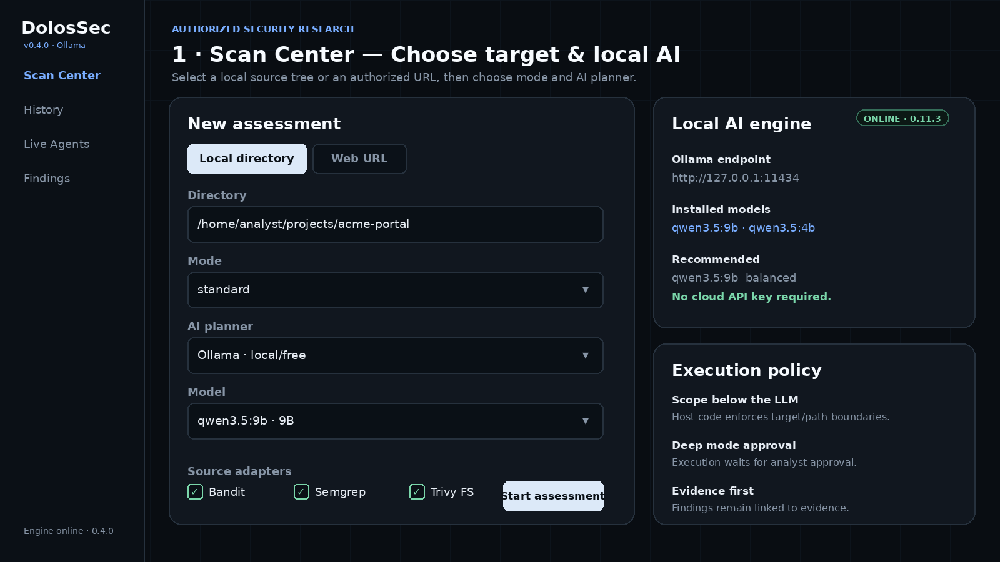
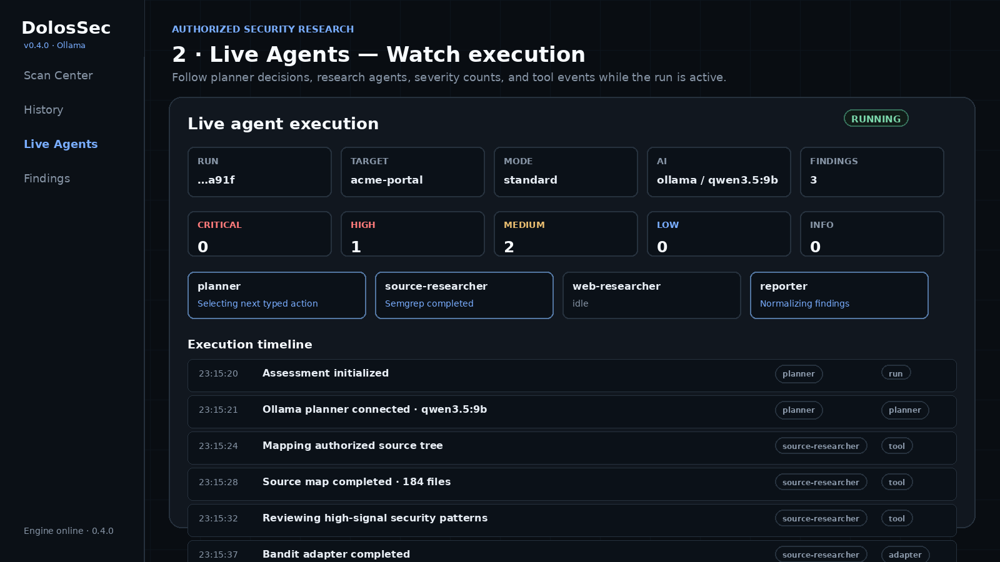
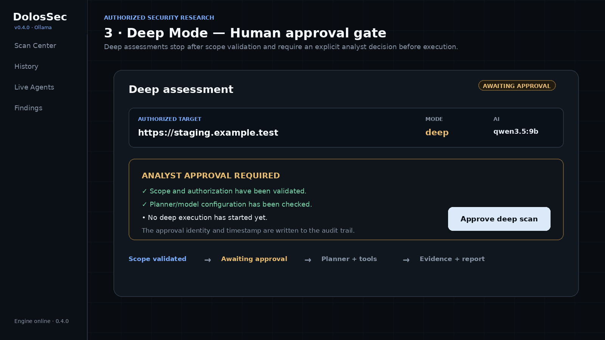
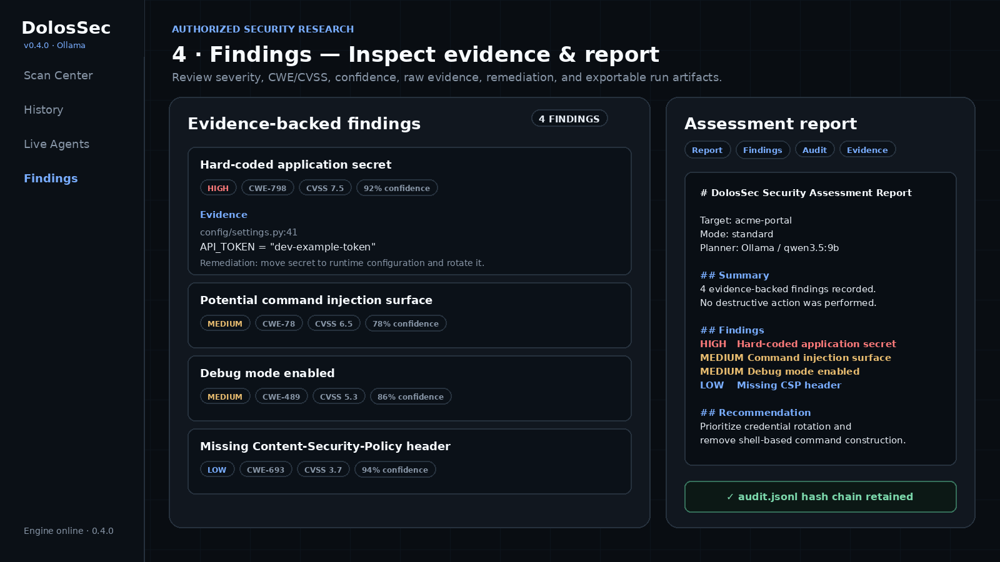

<p align="center">
  
</p>

<h1 align="center">DolosSec</h1>

<p align="center">
  <strong>AI-Assisted Security Research Console</strong><br>
  Local AI · Policy-Gated Execution · Live Web Console · Evidence-Driven Findings
</p>

<p align="center">
  
  
  
  
  
  
</p>

---

## What is DolosSec?

**DolosSec** is a clean-room security-research framework for **authorized application-security assessments**. It combines a local AI planner, deterministic security tooling, scope enforcement, live evidence collection, and structured reporting in one local web console.

The project is built around one trust rule:

> **AI proposes → policy authorizes → tools execute → evidence becomes findings.**

The AI model is **not** the security boundary. A planner response cannot directly launch arbitrary shell commands or ignore scope. Proposed actions are parsed into typed models and must pass host-side policy before execution.

DolosSec v0.5 performs real source analysis, policy-gated HTTP inspection, optional local security-tool execution, Ollama-backed planning, evidence normalization, scan history, analyst approval for Deep mode, and report generation.

> [!IMPORTANT]
> DolosSec is intended only for systems, applications, labs, and source trees you are authorized to assess. It is not presented as a replacement for a full professional penetration test.

---

## What works today

| Capability | Status | Notes |
|---|:---:|---|
| Local source-tree assessment | ✅ | Manual path entry + restricted directory browser |
| Authorized URL assessment | ✅ | Explicit scope/authorization metadata required |
| Local Ollama AI planner | ✅ | Native local REST API integration |
| Qwen3.5 model profiles | ✅ | 4B / 9B / 27B configurations |
| Deterministic no-AI planner | ✅ | Reproducible fallback mode |
| OpenAI planner | ✅ | Optional, separately configured |
| Live execution timeline | ✅ | Server-Sent Events |
| Incremental findings | ✅ | Findings appear during the run |
| Scan history | ✅ | Recovered from run artifacts after restart |
| Deep-mode human approval | ✅ | Explicit analyst approval before execution |
| CWE mapping | ✅ | Where evidence/rule mapping is available |
| CVSS display | ✅ | When an underlying source provides a score |
| Bandit adapter | ✅ | Operator-selected, policy-gated |
| Semgrep adapter | ✅ | Uses project-controlled `.semgrep.yml` |
| Trivy filesystem adapter | ✅ | Operator-selected, policy-gated |
| Nuclei detection | ⚠️ | Capability is detected; network-template execution is disabled in v0.4 |
| Hash-chained audit log | ✅ | Tamper-evident JSONL execution record |
| Markdown + JSON artifacts | ✅ | Report, findings, observations, audit |
| Hardened multi-user remote console | 🚧 | Planned; current web UI is loopback/local-first |
| Container isolation per third-party scanner | 🚧 | Planned; external scanners are currently part of the trusted computing base |

---

# Usage walkthrough

The images below are **documentation walkthrough renders based on the current v0.4 interface and representative sample data**. They show the real workflow and fields without claiming the sample findings came from a third-party production system.

## 1. Choose a target and local AI model

Select a **local directory** or switch to **Web URL** for an authorized remote target. Choose Quick, Standard, or Deep mode, then select Ollama and an installed model.

<p align="center">
  
</p>

For local projects you can enter an absolute source path such as:

```text
/home/analyst/projects/acme-portal
```

For web targets, DolosSec also records authorization details such as owner/operator, ticket/reference, assessment purpose, and expiration.

---

## 2. Watch the scan while it runs

The console exposes the active run rather than hiding everything behind a spinner. You can see the selected planner/model, agent state, severity counters, and execution events as they arrive.

<p align="center">
  
</p>

Typical execution events include:

```text
Assessment initialized
Ollama planner connected · qwen3.5:9b
Mapping authorized source tree
Source map completed
Reviewing high-signal security patterns
Bandit adapter completed
Semgrep adapter completed
Findings normalized
Report generated
```

The planner proposes typed actions such as `source_map`, `source_review`, or policy-gated HTTP checks. The host policy decides whether the action is allowed.

---

## 3. Deep mode requires an analyst decision

A **Deep** assessment does not immediately execute extended research steps. DolosSec first validates scope and configuration, then stops at a human approval checkpoint.

<p align="center">
  
</p>

The approval identity and timestamp are written into the audit trail. This makes the approval a real workflow control rather than a cosmetic UI button.

---

## 4. Review evidence-backed findings and export the report

Findings are normalized with the evidence and metadata DolosSec actually has available: severity, CWE, CVSS when supplied, confidence, source tool, remediation, and supporting output.

<p align="center">
  
</p>

A completed run can expose downloadable artifacts including:

```text
report.md
findings.json
observations.json
audit.jsonl
```

---

# Quick start

## Requirements

- Python **3.12+**
- Linux, macOS, or Windows
- Ollama for the recommended local/free AI workflow
- One local Ollama model such as `qwen3.5:9b`

Clone the repository and create an environment:

### Linux / macOS

```bash
git clone https://github.com/YOUR-USERNAME/dolossec-agent.git
cd DolosSec

python3 -m venv .venv
source .venv/bin/activate
pip install -e '.[ai,dev]'
```

### Windows PowerShell

```powershell
git clone https://github.com/YOUR-USERNAME/dolossec-agent.git
cd DolosSec

py -3.12 -m venv .venv
.\.venv\Scripts\Activate.ps1
pip install -e ".[ai,dev]"
```

> Replace `YOUR-USERNAME` after you upload the repository to GitHub.

---

# Local AI with Ollama

DolosSec v0.5 talks directly to the local Ollama API at:

```text
http://127.0.0.1:11434
```

No cloud AI API key is required for this workflow.

## Linux / Kali / Debian / Ubuntu

Install Ollama:

```bash
curl -fsSL https://ollama.com/install.sh | sh
```

Verify/start it:

```bash
ollama -v
sudo systemctl start ollama
sudo systemctl status ollama
```

If you are using a manual installation rather than the service installer:

```bash
ollama serve
```

## macOS

Install Ollama using the Ollama macOS application, launch it once, then verify:

```bash
ollama -v
```

## Windows

Install Ollama with the Windows installer, then open a new PowerShell session and verify:

```powershell
ollama -v
```

## Pull the recommended model

Balanced/default profile:

```bash
ollama pull qwen3.5:9b
```

Lower-memory profile:

```bash
ollama pull qwen3.5:4b
```

Larger workstation profile:

```bash
ollama pull qwen3.5:27b
```

### Recommended profiles

| Profile | Model | Approx. download | Intended use |
|---|---|---:|---|
| Lightweight | `qwen3.5:4b` | ~3.4 GB | Smaller laptops / basic planning |
| **Balanced** | **`qwen3.5:9b`** | **~6.6 GB** | Recommended default |
| Strong | `qwen3.5:27b` | ~17 GB | Larger-memory workstations |

Configure DolosSec:

```bash
cp .env.example .env
```

Default local-AI values:

```dotenv
DOLOS_LLM_PROVIDER=ollama
DOLOS_MODEL=qwen3.5:9b
DOLOS_OLLAMA_BASE_URL=http://127.0.0.1:11434
DOLOS_OLLAMA_ALLOW_REMOTE=false
DOLOS_OLLAMA_TIMEOUT_SECONDS=180
DOLOS_OLLAMA_NUM_CTX=32768
DOLOS_OLLAMA_NUM_PREDICT=1200
DOLOS_OLLAMA_TEMPERATURE=0.1
DOLOS_OLLAMA_KEEP_ALIVE=10m
```

Verify the integration:

```bash
dolos doctor
dolos ollama status
dolos ollama test
```

`dolos ollama test` asks the local model for one structured planner turn but does **not** execute the returned security action.

For the complete Ollama guide, see [`docs/OLLAMA.md`](docs/OLLAMA.md).

---

# Start the web console

```bash
dolos web
```

Open:

```text
http://127.0.0.1:8787
```

The web control plane intentionally defaults to **loopback** rather than exposing the security console to your LAN.

### What the web console provides

- local-directory and authorized-URL target selection;
- Ollama online/offline status;
- installed local model discovery;
- Quick / Standard / Deep modes;
- optional local source adapters;
- live AI/agent execution timeline;
- severity dashboard;
- evidence-backed findings;
- persistent run history;
- analyst approval for Deep mode;
- Markdown report rendering;
- report/findings/evidence/audit downloads.

---

# CLI usage

The web UI is the primary workflow, but the CLI remains fully available.

## Local source scan

```bash
dolos scan ./your-app --mode standard
```

## Authorized web scan

Create a scope file:

```bash
dolos init scope.yaml
```

Edit the authorization and scope values, then run:

```bash
dolos scan https://staging.example.com \
  --scope scope.yaml \
  --mode standard
```

Remote targets are refused without an explicit authorization manifest.

## Ollama commands

```bash
dolos ollama install-guide
dolos ollama status
dolos ollama pull qwen3.5:9b
dolos ollama test
```

---

# Optional security adapters

External source scanners are disabled by default:

```dotenv
DOLOS_ENABLE_EXTERNAL_TOOLS=false
```

After you install the supported tools on the host, explicitly enable adapters:

```bash
export DOLOS_ENABLE_EXTERNAL_TOOLS=true
dolos web
```

Currently recognized source adapters:

| Adapter | Purpose | v0.4 execution |
|---|---|:---:|
| Bandit | Python security static analysis | ✅ |
| Semgrep | Rule-based source analysis | ✅ |
| Trivy FS | Filesystem dependency/secret analysis | ✅ |
| Nuclei | Network template scanner | ⛔ execution disabled |

The model does not receive a generic shell. Adapter commands are assembled through fixed host-side argument logic.

> [!WARNING]
> Bandit, Semgrep, and Trivy are constrained by DolosSec adapters but are **not yet kernel/container isolated per scan** in v0.4. If enabled, those third-party processes remain part of the trusted computing base.

---

# How the AI planner works

DolosSec uses the model as a **planner**, not as a direct executor.

```text
Authorized Target
      │
      ▼
Scope / Path Policy
      │
      ▼
Ollama · qwen3.5
      │
      │ PlannerTurn JSON
      ▼
Pydantic Validation
      │
      ▼
Trusted Policy / Tool Broker
      │
   ┌──┼──────────────────┐
   ▼  ▼                  ▼
Source HTTP         Host-approved
Review Checks       Source Adapters
   │  │                  │
   └──┴──────────┬───────┘
                 ▼
              Evidence
                 │
                 ▼
              Findings
                 │
                 ▼
               Report
```

The planner receives a bounded subset of current observations and must return structured JSON. Source files, comments, HTTP responses, README content, and tool output are treated as **untrusted input**, not model instructions.

Even a prompt-injected planner response must still pass:

1. Pydantic action/schema validation;
2. authorization/scope validation;
3. local-path containment checks;
4. HTTP method and redirect policy;
5. tool-specific execution constraints.

---

# Security model

DolosSec deliberately avoids an unrestricted autonomous-agent pattern.

### Default controls

- explicit, expiring authorization manifests for remote targets;
- hostname/IP/CIDR scope enforcement;
- private-network blocking unless explicitly authorized;
- GET / HEAD / OPTIONS network methods by default;
- redirect re-validation;
- response-size limits;
- request timeouts and rate limits;
- typed model actions;
- loopback-only Ollama by default;
- loopback-first web control plane;
- human approval before Deep execution;
- hash-chained audit events;
- no built-in persistence, destructive action, unrestricted shell, credential attack, or exfiltration module.

More detail:

- [`docs/ARCHITECTURE.md`](docs/ARCHITECTURE.md)
- [`docs/THREAT_MODEL.md`](docs/THREAT_MODEL.md)
- [`docs/OLLAMA.md`](docs/OLLAMA.md)

---

# Assessment artifacts

Each run is written beneath:

```text
dolos_runs/<run-id>/
```

with artifacts such as:

```text
scope.yaml          authorization/scope snapshot
run.json            run metadata including planner/model
web_state.json      persistent web-console state
observations.json   structured tool observations
findings.json       normalized findings
report.md           human-readable report
audit.jsonl         hash-chained execution record
```

This makes it possible to inspect what actually happened rather than relying only on a final AI summary.

---

# Repository structure

```text
dolossec-agent/
├── .github/
│   └── workflows/
│       └── ci.yml
├── assets/
│   ├── dolossec-banner.png
│   ├── usage-01-new-assessment.png
│   ├── usage-02-live-scan.png
│   ├── usage-03-deep-approval.png
│   └── usage-04-findings-report.png
├── docs/
│   ├── ARCHITECTURE.md
│   ├── OLLAMA.md
│   └── THREAT_MODEL.md
├── dolossec/
│   ├── agents/
│   ├── llm/
│   ├── tooling/
│   ├── web/
│   ├── audit.py
│   ├── cli.py
│   ├── config.py
│   ├── models.py
│   ├── policy.py
│   └── reporting.py
├── scripts/
├── tests/
├── .env.example
├── .gitignore
├── CHANGELOG.md
├── CONTRIBUTING.md
├── Dockerfile.runtime
├── LICENSE
├── README.md
├── SECURITY.md
├── pyproject.toml
├── runtime-example.sh
└── scope.example.yaml
```

---

# Development and tests

Install development dependencies:

```bash
pip install -e '.[ai,dev]'
```

Run the test suite:

```bash
pytest
```

The v0.4 test suite currently covers scope enforcement, path/method denial, audit-chain integrity, source review, web-origin protection, remote authorization requirements, Deep-mode approval, scan history, the web-triggered assessment flow, Ollama loopback enforcement, model discovery, structured planner parsing, and an Ollama-compatible end-to-end planning flow.

Current release baseline:

```text
15 tests passing
```

---

## v0.5 web assessment engine

Remote URL scans now perform a mandatory, host-controlled passive discovery phase before an AI planner can end the run. Different applications therefore produce different attack-surface inventories even when they share the same missing security headers.

The web inventory records same-origin pages, forms, query parameter names, scripts, API/service hints, cookies, CORS signals, technology disclosures, robots.txt/sitemap.xml responses, and mixed-content references. It does **not** submit forms, brute-force paths, mutate application state, or send exploit payloads.

The final report includes a **Web attack surface** section in addition to evidence-backed findings.

---

# Roadmap

The next milestones are focused on making DolosSec more capable **without weakening the execution boundary**.

### v0.5 direction

- [ ] separate Recon / Source / Web / Vulnerability Reasoning / Evidence Validator agents;
- [ ] isolated per-tool runner/container supervisor;
- [ ] authenticated application-session handling;
- [ ] HTTP request/response inspector;
- [ ] dependency and attack-surface graphing;
- [ ] richer CVSS calculation and finding deduplication;
- [ ] configurable local skill/rule packs;
- [ ] scan-to-scan comparison and regression diffing;
- [ ] stricter template-level policy model for future Nuclei support;
- [ ] stronger reporting/export formats;
- [ ] authenticated multi-user/SOC deployment mode after the local security model is mature.

---

# Responsible use

Use DolosSec only where you have explicit authorization.

Good targets include:

- your own source repositories;
- your own applications;
- dedicated staging systems;
- internal systems where you are authorized to assess;
- CTFs and training labs;
- deliberately vulnerable applications and test ranges.

Do not use the project to scan or test systems you do not own or have permission to assess.

---

# Contributing

Contributions are welcome. Start with [`CONTRIBUTING.md`](CONTRIBUTING.md), and keep security-sensitive changes aligned with [`SECURITY.md`](SECURITY.md) and the documented threat model.

Useful contribution areas include:

- new evidence parsers;
- source-analysis adapters;
- safer sandboxing/runtime controls;
- finding normalization;
- web-console UX;
- local-model evaluation;
- defensive test fixtures;
- documentation and platform support.

---

# License

Licensed under the **Apache License 2.0**. See [`LICENSE`](LICENSE).

<p align="center">
  <strong>DolosSec</strong><br>
  Secure systems. Protect data. Strengthen defenses.
</p>
